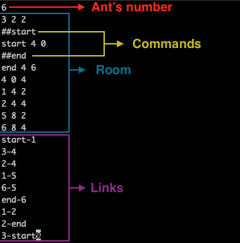
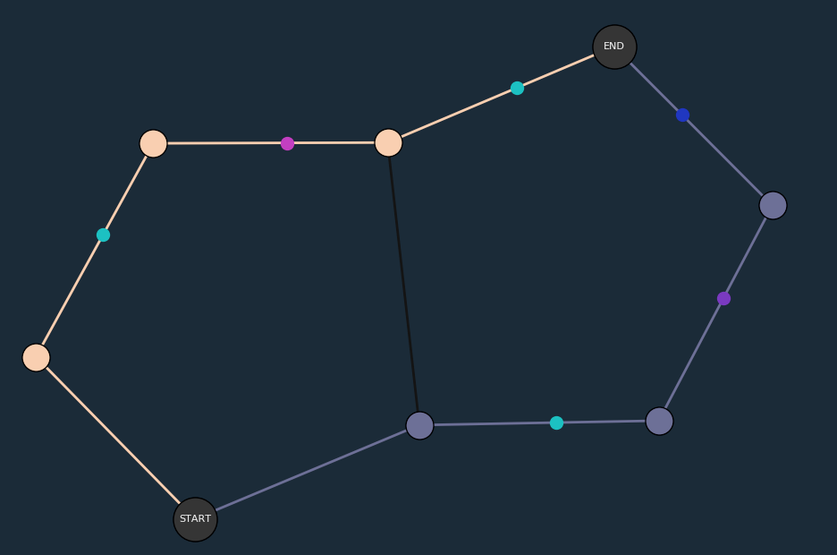
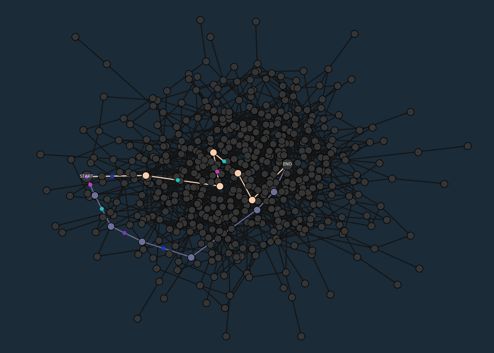

## Lem-in
---

## What is Lem-in?

Lem-in is an algorithmic project focusing on graphs. The goal is to reproduce an ant farm manager behaviors.

If this last sentence does not make much sense for you, here is an explanation:

We built a program which, given a farm description and a number of ant, will return an optimized list of ant's moves. The given result will describes all ant's moves from starting to lead them to the end room.

The most optimized answer will be the one with the less turns to move all ant.

## Description

### Input :

The software reads standard entry. 
It is expecting the description of a farm, which must contains :
* Ant's number (a number)
* Rooms (syntax : [Name Y X] - where X and Y are coordonates)
* Links (Syntax : [room(A)-room(B)])
* Start command (to indicate the ant's spawnig room)
* End command (to indicate the ant's goal)

###### In addition :

<<<<<<< HEAD
Start and end are commands, they starts with "##".
All lines starting with "#" are comments.
All lines starting with "##" are commands.
If the line is an unknown command, it will be ignored.
=======
* Start and end are commands, they starts with **"##"**.
* All lines starting with **"#"** are comments.
* All lines starting with **"##"** are commands.
* If the line is an unknown command, it will be ignored.
>>>>>>> 4c5527ba28f8b3c5df361092be59922144d08c40




### Algorythm :


## Visualizer :

The visualizer has been coded in python 3 using two main libraries : 

* matplotlib

* networkx

### Installation: 

###### GNU/Linux debian based :

Matplotlib and networkx require numpy and tkinter (tk) :

```
sudo apt install python3 python3-matplotlib python3-networkx python3-numpy python3-tk
```

###### Mac os :

```
brew install libpng freetype pkg-config NumPy
python -mpip install . (this is is to be checked, think we install pip3)
pip3 install matplotlib
pip3 install networkx
```

### Usage :

To display all visu options and features :

```
./visualizer.bash
```

To launch our lem-in and view it :

```
./visualizer.bash [-map_file] [-option_visu_1] [-option_visu_2] [etc..]
```

### Examples :




