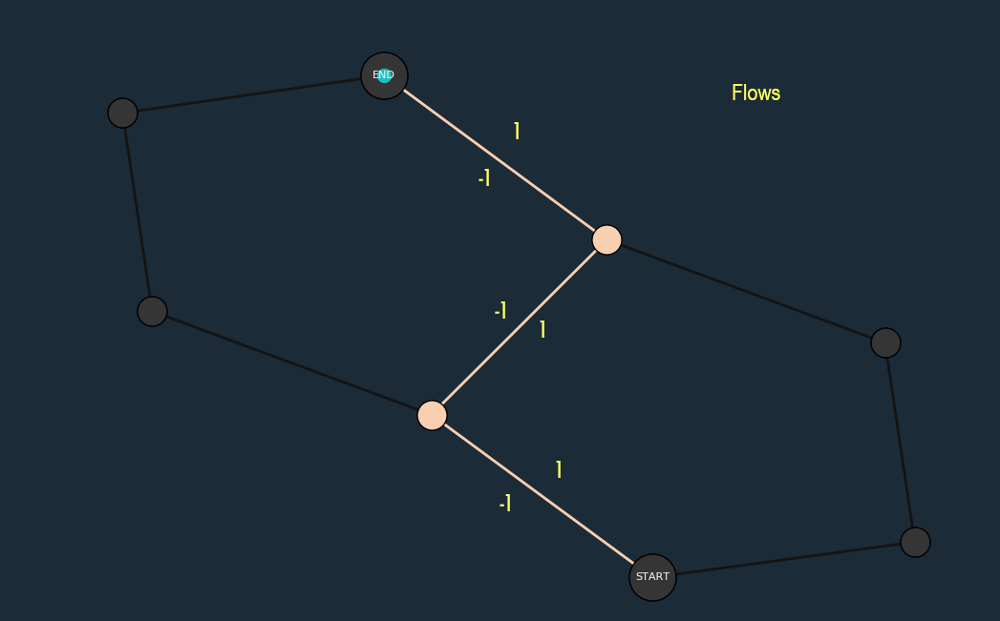
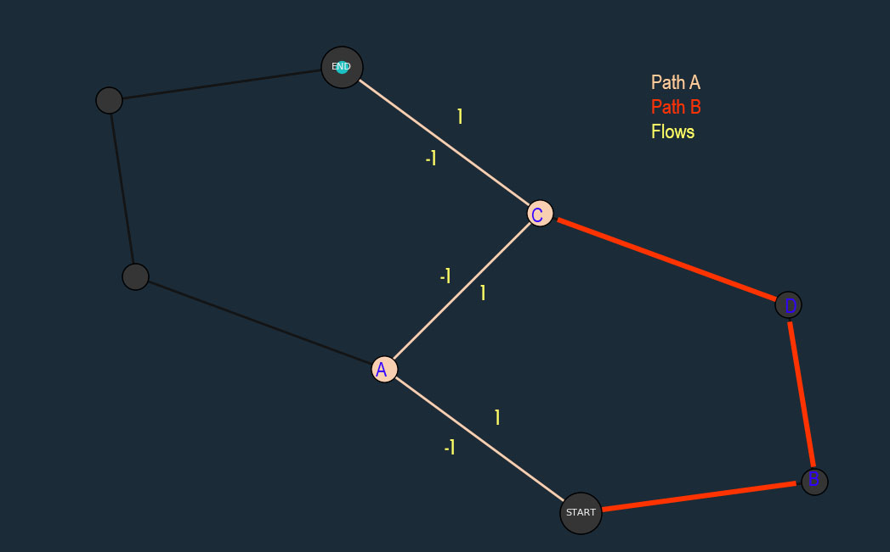
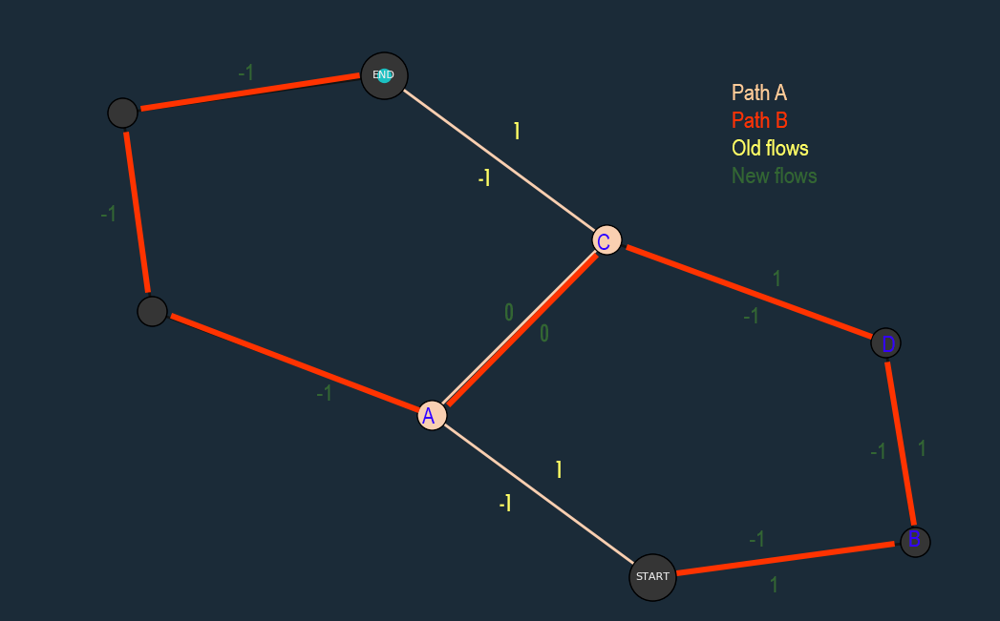
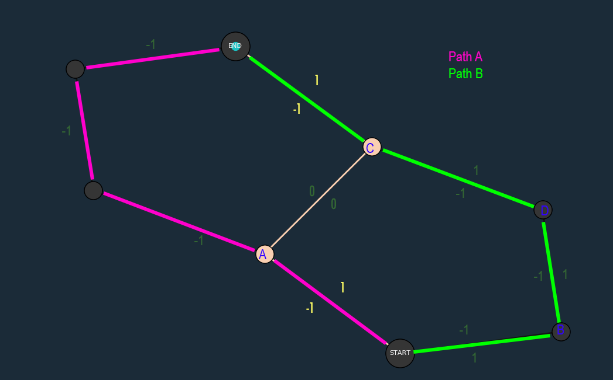
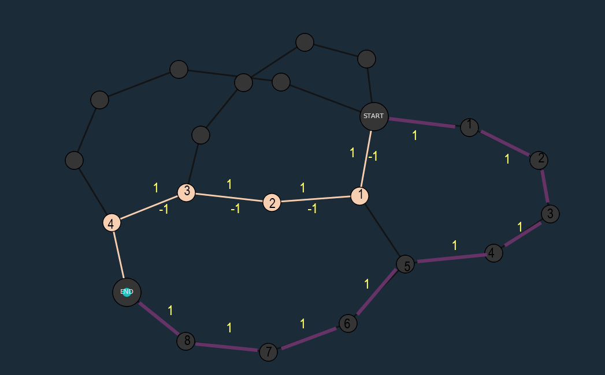
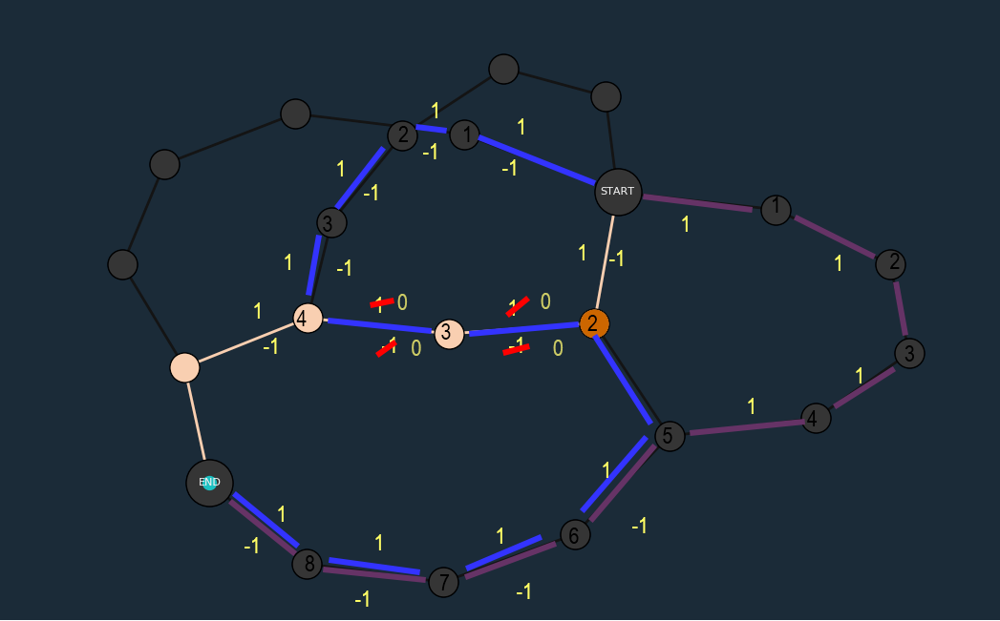
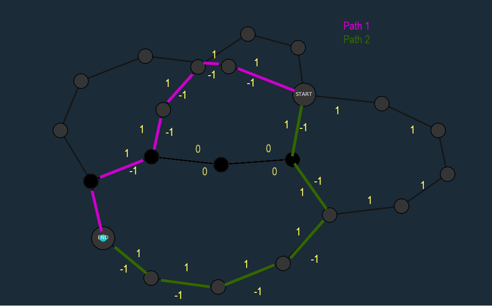
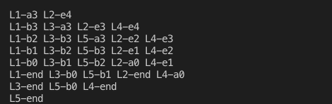

## Lem-in
---

## What is Lem-in?

Lem-in is an algorithmic project focusing on graphs. The goal is to reproduce the behaviours of an ant farm manager.

If this last sentence does not make much sense for you, here is an explanation:

We built a program which, given an ant farm description (rooms, connecting tubes, start and finish) and a number of ants, will find a set of paths, and return an optimized list of the ant's moves. The given result will describes all of the ant's moves from the start until the end room.

Our goal is not simply to get all the ants from one end of the ant farm to the other, it is to get them there while printing the minimum possible amount of lines on the stdout, i.e. get them out of the antfarm as quickly as possible.

## Description

### Input :

The software reads standard entry. 
It is expecting the description of a farm, which must contains :
* Ant's number (a number)
* Rooms (syntax : [Name Y X] - where X and Y are coordonates)
* Links (Syntax : [room(A)-room(B)])
* Start command (to indicate the ant's spawnig room)
* End command (to indicate the ant's goal)

###### In addition :

* Start and end are commands, they starts with **"##"**.
* All lines starting with **"#"** are comments.
* All lines starting with **"##"** are commands.
* If the line is an unknown command, it will be ignored.


### Usage:

Run the make command to create the executible ./lem-in. Lem-in reads from the standard input, so you can cat one of the provided maps and pipe the result to lem-in. i.e.

cat test_1 | ./lem-in


### THE ALGORITHM


#### THE TASK
The task demanded for this particular task is quite particular. Except for very small quantities of ants, we are not looking for simply the shortest path. In fact, sometimes the shortest path will block a multi-path solution that will lead to a better optimized result. What is an optimized result in this project? We are looking to print the minimum amount of lines possible. A line terminates when we have moved all the ants already on the path by one room, and when (if necessary) we have sent one new ant per path out on our chosen solution set. So an algorithm like Dijkstra’s shortest path algorithm will not suffice.


This leads us now naturally to Edmond-Karp’s or the Ford-Fulkerson method for computing the maximum flow in a flow network. Here we can find maximum flow of our graph (i.e. optimising the amount of ants in the ant farm at one time). This involves using B.F.S (Breadth First Search) to explore the nodes by level. We add our starting node to the queue, and then add its’ children to the queue, marking start as the parent node, we then add the grandchildren to the queue, marking its’ parent, and so on and so forth until we reach the end node. We note which nodes we have visited and never visit the same node twice. We can then retrace the path of parent’s from end to start, and hence find a valid path. What Edmond-Karp’s adds to BFS is a theory of flows. When we mark a link from A to B, we will note that the flow from A to B is 1, and from B to A is -1. As all of our edges in this project have a capacity of 1, the flow from A to B is now saturated. The flow from to B to A is NOT saturated, so we can reuse these nodes but traveling in the opposite direction. If we do so, this neutralises flow an and we reset the flow between A and B, and B and A, to 0.  





On this first iteration of Edmond-Karp’s, we find the shortest path and mark the flows. 





On the second iteration we try and find other paths. First We will not revisit node A, is it is already in Path A. Path B will then be blocked a Node C, which is already in Path A. 





But if we take into account the flows, Path B can make use of the negative flow between C and A, and then continue on to End. We revise the flows, remembering than when we take a negative flow, we neutralize it to zero. 





We now send our pathfinder, which can only take flows of 1, and not flows of zero, and it will find Path A and Path B.


Unfortunately we found that even with an effective implementation of EdmondKarp's with BFS, we were getting good results, but not great results. We then borrowed an idea from DFS (depth first search), and started keeping track of the node's "weight" (depth, i.e. distance from start), but unlike DFS, we are not going to check the depth of every single node in the map. When we are pathfinding, if we encounter a node that is already in a path, instead of ignoring it, we will compare its' weight with its’ potential weight, should it change parent nodes. If it’s a good switch, and the switch will not create path conflicts, we swap parent nodes.




Here our standard Edmond-Karp’s with BFS finds us these two paths. The number on each node represents its’ weight/depth (distance from start).



On the next iteration, we try to find another path, (please note that when we take negative flows, the weight decreases by one as opposed to increasing by one) but at the orange node, normally we would stop. The next node (currently weight 5) is in use in another path. But now, with our new system of weights, we compare the current weight (5) with it’s potential weight (the parent node + 1 as we would be creating a flow of 1), the potential weight is smaller than the current weight, so we switch parent nodes, and now the purple path is broken, and we link the orange node to what was the node with a weight of 5, giving it a weight of 3. 



With the updated flows from the previous path found, we now find these two optimal paths.


## Output

Our program prints the output in the following way. Each movement is prefixed by a "L". The number directly after the L indicates the ant's identifying number, that is followed by a "-" and then the room it has moved to. Each ant can only make one move per turn, there can not be two ants in a room at the same time, and each turn starts on a new line. 




## Visualizer :

The visualizer has been coded in python 3 using two main libraries : 

* matplotlib

* networkx

### Installation: 

The visualizer has been coding with Python 3.7
Requirement : Python 3.7

###### GNU/Linux debian based :

Matplotlib and networkx require numpy and tkinter (tk) :

```
sudo apt install python3 python3-matplotlib python3-networkx python3-numpy python3-tk
```

###### Mac os :

```
brew install libpng freetype pkg-config NumPy
pip3 install matplotlib
pip3 install networkx
```

### Usage :

To display all visu options and features :

```
./visualizer.bash
```

To launch our lem-in and view it :

```
./visualizer.bash [-map_file] [-option_visu_1] [-option_visu_2] [etc..]
```

### Examples :


